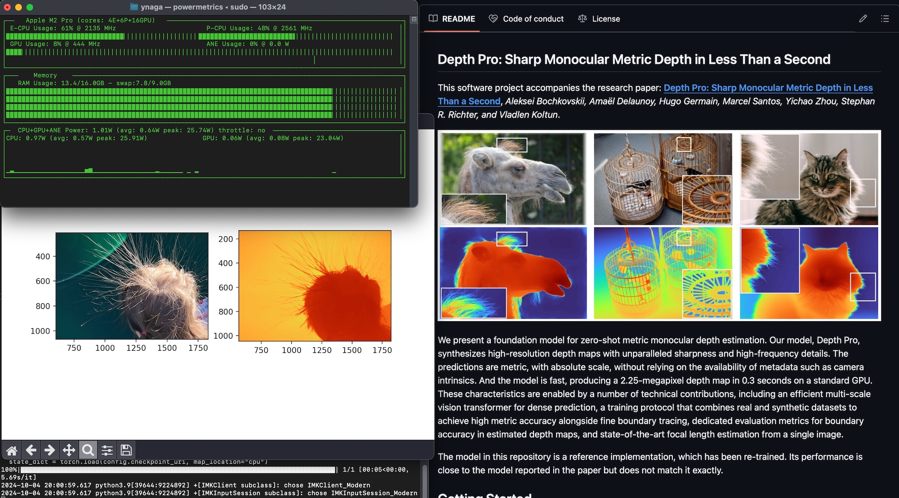

# ShaderGraph by Examples in visionOS

This project shows examples of ShaderGraph in visionOS 2.

- GitHub : https://github.com/ynagatomo/ShaderGraphByExamples
- Xcode 16.1+ , visionOS 2.1+
- Some examples only work with a real Apple Vision Pro device.

## ShaderGraph Examples

| | Example | Name | Description |
| --- | --- | --- | --- |
|  | Ex01 | Interior Mapping  | Calculating the intersection of the line of sight and the wall and draw a space with pseudo depth. |
|  | Ex02 | Warp VFX  | A procedural warp effect shader. You can change the movement, color, and pattern by changing the node's parameters. |
|  | Ex03 | Jewel  | A very simple Jewel shader with the Environment Radiance Node. |
|  | Ex04 | Nebula 3D  | A nebula with a 3D texture consisting of six 2D texture slices. |
|  | Ex05 | Transition Depth | A transition with a depth-map. |
|  | Ex06 | Stereoscopic Depth |Stereoscopic display with a depth-map. Apple Vision Pro is required to see. |

### 3D Texture Image File: KTX

An example of how to create a 3d texture image file, '.ktx', with Blender and Apple TextureConverter. 

1. Render image slices of a volumetric 3d scene.
2. Convert them to a ktx file with Apple TextureConverter using '--build_volume' option.
3. Use the ktx texture file with the Image3D shader-graph node.

### Depth-map

There are many ways to create depth-map textures, for example, using the Apple Depth Pro.

apple/ml-depth-pro: Sharp Monocular Metric Depth in Less Than a Second, 
a foundation model for zero-shot metric monocular depth estimation.

GitHub: https://github.com/apple/ml-depth-pro

Depth Pro CLI: `% depth-pro-run -i mydata/girl.png -o results --skip-display`

Modify Apple Depth-Pro's python code to save grayscale depth-map;

ml-depth-pro/src/depth_pro/cli/run.py:

`90    cmap = plt.get_cmap("binary") # for grayscale depth map`

### Stereoscopic rendering with Blender

To create side-by-side images for stereoscopic display on Apple Vision Pro,
you can use Blender like below.

## References

- Sample Code: ShaderGraph Examples in visionOS 1.2 [GitHub: ynagatomo/SGMExamples](https://github.com/ynagatomo/SGMExamples)
- Documentation: ShaderGraph Nodes in RealityKit [GitHub: ynagatomo](https://github.com/ynagatomo/evolution-Metal-ARKit-RealityKit-sheet#shadergraph-nodes-in-realitykit)
- Article: ShaderGraph in visionOS (Jan 6, 2024) [Medium: ynagatomo](https://levelup.gitconnected.com/shadergraph-in-visionos-45598e49626c)

## Change logs

click to open

1. [Nov 3, 2024] Added the Ex01, "Interior Mapping Shader"
1. [Nov 17, 2024] Added the Ex04, Ex05, Ex06, "Nebura with a 3D texture"

## License

MIT License

since Nov, 2024
